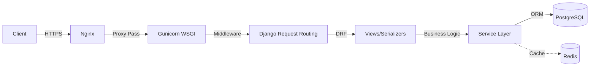

# GrantLoop Backend Architecture

## Application Modules
The monolith is separated into strictly isolated domain applications (`apps/`):
- `accounts`: User identity and RBAC.
- `ngos`: Organization verification and execution partners.
- `campaigns`: Fundraising entities and milestones.
- `donations`: Payment ingestion and payouts.
- `reports`: Financial audits and streaming exporters.
- `analytics`: Aggregated time-series calculation.
- `cache_utils`: Shared Redis logic.
- `performance`: System telemetry and health.

## Request Flow

## Authentication Flow
Stateless JWT (JSON Web Tokens). Clients receive `access` and `refresh` tokens upon `/api/v1/auth/login/`.

## Payments Flow
Idempotent webhook receivers process asynchronous signals from Stripe/Razorpay. Raw payloads are verified via cryptographic signatures, persisted to an event ledger, and atomically transitioned into verified `Donation` records.

## Reporting Flow
Heavy Excel/PDF generations are triggered via HTTP. The controller dispatches a Celery task and immediately returns an HTTP 202 Accepted. The Celery worker generates the file, stores it in the media volume, and pushes a Notification to the user with the download link.

## Caching Strategy
Aggressive Redis caching for read-heavy endpoints (Campaigns, NGO Profiles). Cache invalidation is triggered synchronously within the Service layer during write mutations (Create/Update/Delete).

## Celery Architecture
- **Worker**: Processes queued background tasks (emails, reporting, cache clearing).
- **Beat**: Triggers periodic maintenance schedules (e.g., daily database hygiene).

## Deployment & Monitoring Architecture
- **Nginx**: Edge proxy, SSL termination, static file delivery.
- **Prometheus & Sentry**: Observability and error tracing.
