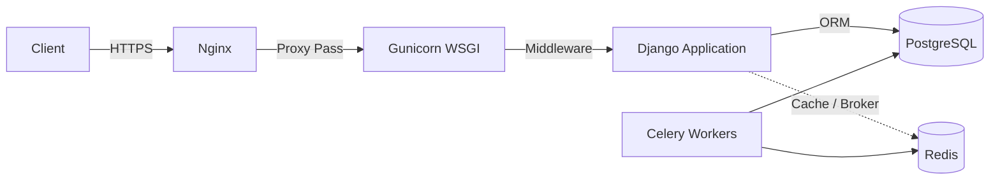

# GrantLoop Backend SaaS Platform


## Project Overview
**GrantLoop** is a production-grade, audited SaaS platform engineered for transparent non-profit fundraising, milestone verification, compliance document tracking, and fund disbursement reconciliation. It provides a highly scalable REST API facilitating seamless interactions between Admins, NGOs, and Donors.

## Architecture Diagram


## Installation & Development
```bash
# Clone and enter the repository
git clone <repo>
cd grantloop/backend

# Initialize environment
cp deployment/development.env.example .env

# Run development server with auto-reload
docker compose up --build -d
```
Access the local environment at `http://localhost:8000/`.

## Production Deployment
The production deployment utilizes a highly secure Docker Compose topology governed by an Nginx reverse proxy.
```bash
# Copy and configure production credentials
cp deployment/production.env.example .env

# Execute production stack
docker compose -f docker-compose.prod.yml up -d --build
```
Detailed deployment workflows, HTTPS configuration, and verification steps are located in the `deployment/` directory.

## Monitoring
GrantLoop includes robust telemetry:
- **System Health**: `GET /api/health/`
- **Prometheus Metrics**: `GET /metrics`
- **Sentry Integration**: Exception tracking enabled via `SENTRY_DSN`.
- **Flower Dashboard**: Celery queue inspection at `http://<server>:5555/`.

## API Documentation
An interactive OpenAPI 3.0 developer portal is automatically generated via `drf-spectacular`.
- **Swagger UI**: `/api/docs/`
- **ReDoc**: `/api/redoc/`

## Testing
To run the complete automated regression suite:
```bash
docker compose exec backend python manage.py test --settings=grantloop.settings.sandbox_test
docker compose exec backend python manage.py check --settings=grantloop.settings.sandbox_test
```

## Roadmap
- Real-time WebSocket notifications.
- Kubernetes (Helm) deployment manifests.
- Multi-currency conversions for global donations.

## Contribution Guidelines
1. Do not push directly to `main`.
2. All feature branches must achieve 100% test coverage for new business logic.
3. Schema migration drift must be strictly resolved locally prior to opening a Pull Request.
4. Adhere to Semantic Versioning for all API updates.
